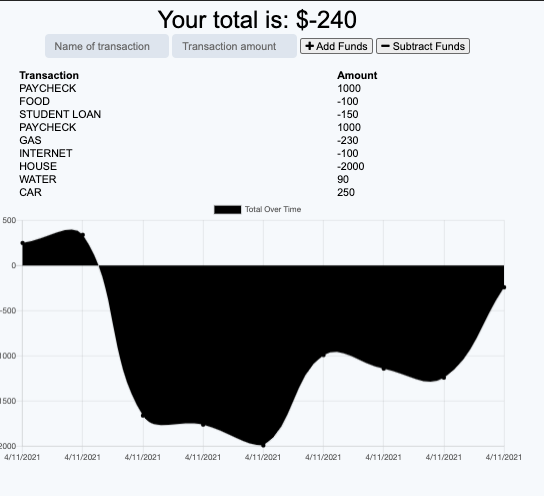

## Nerd Budget
## Description
This is an app that gives users a fast and easy way to track their money! This will allow the user to access their own money information like a general ledger with checks and balanaces. The user is able to add their assets and subtract their liabilities without a internet connection. If the user enters transactions offline, the total should be updated when they're brought back online.    
## Mock Up 
 


## User Story
  
```
AS AN avid traveler
I WANT to be able to track my withdrawals and deposits with or without a data/internet connection
SO THAT my account balance is accurate when I am traveling 
```
  
## Acceptance Criteria
  
``` 
GIVEN a budget tracker without an internet connection
WHEN the user inputs an expense or deposit
THEN they will receive a notification that they have added an expense or deposit
WHEN the user reestablishes an internet connection
THEN the deposits or expenses added while they were offline are added to their transaction history and their totals are updated friend list

```
## Installation 
`npm init`

`npm i compression`

`npm i express`

`npm i mongoose`

`npm i morgan`

`npm i nodemon`

## Usage

- TERMINAL $npm start
- ROOT: http://localhost:3001/